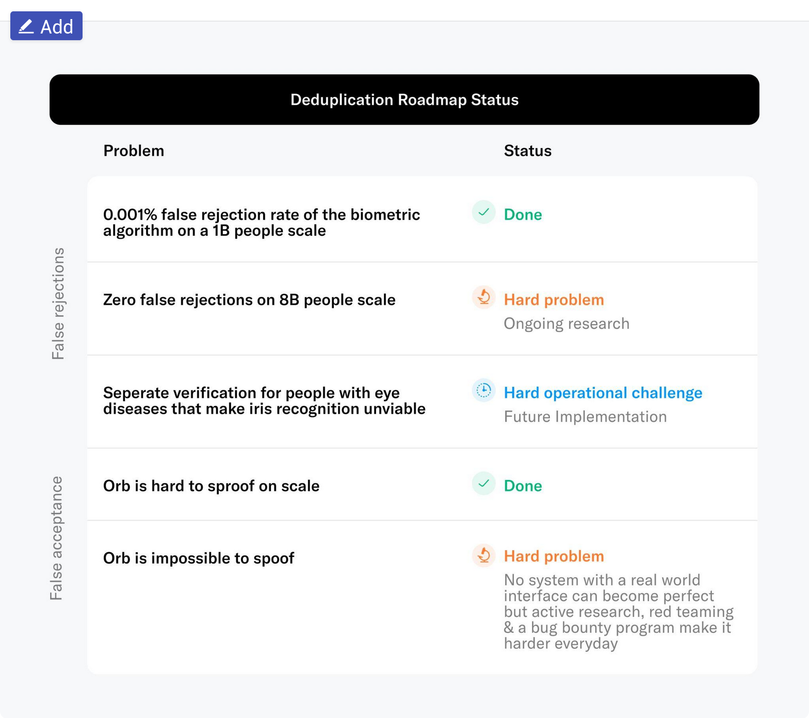
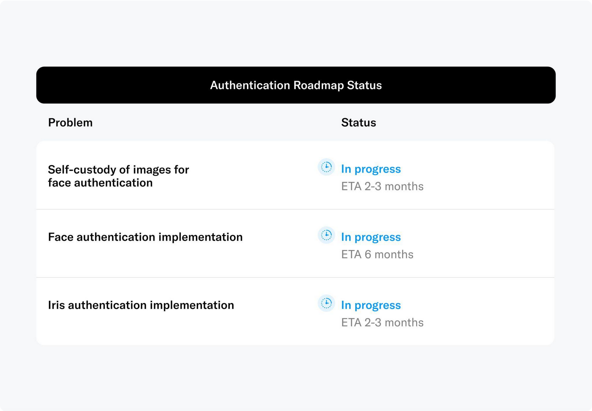
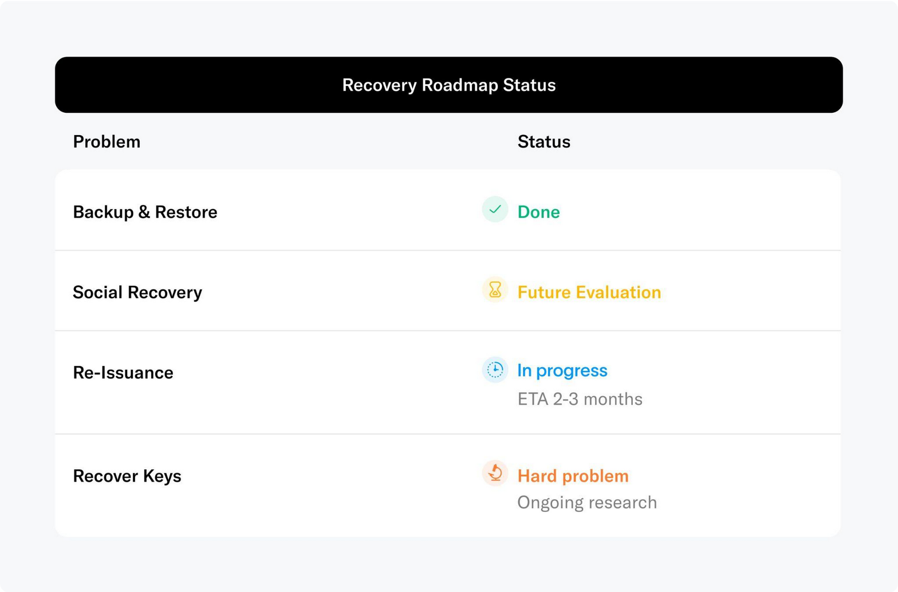

What is digital identity?

- Digital Identity is a set of measurable characteristics that tie activity on the internet to an external entity, whether it is a human or an AI system.
- In 2023, about 500,000 video and voice deep fakes were shared on global social media. AI is now able to create convincing but entirely fake voice recordings, images, passports, and movies for and about anyone. Already, all notable people on earth - billionaires, politicians, artists, and bankers - from Elon Musk to Warren Buffet, Kim Kardashian, and Xi Jinping, struggle to combat misinformation and deep fakes.
- The fundamental question of what is real, true, and authorized, on the one hand, and what is fake, on the other, is one of the most pressing needs in digital technology.
- Unfortunately, there is no trusted global system for authenticating information that supposedly comes from you. The lack of such a technology makes it difficult for people to transact on the internet and protect their name and their business.
- Risks of targeted deep fakes are theft of funds from your bank, the loss of your job, and the loss of revenue due to copyright violations. On a societal level, deepfakes can influence elections, sway financial markets, and undermine human trust in entire business sectors.
- Furthermore, identity fraud, fake IDs, and Sybil Attacks (an individual with multiple real accounts) directly pose a threat to our functioning economy and democracy.

What are some potential remedies to this issue?

- One project, Worldcoin, is actively working to combat fraud and impersonation on the internet while preserving individual autonomy and privacy.
- The core idea of Worldcoin centers around the concept of “proof of personhood,” (PoP) which aims to identify each and every human as unique. “Proof of personhood” gives an individual the ability to assert they are a real human and different from another real person without having to share their identity.
- Worldcoin uses a custom biometric device called the Orb to do PoP, which they argue is the most effective form of human identification since it cannot be copied or faked, and almost everyone has one. They argue against current KYC (Know Your Customer) setups as over 50% of the world does not have a Photo ID, but they do have an iris.
    - For PoP, the most important part is not identification, but rather proving that someone has not been verified yet (to prevent fraud). I.e. we care more about “Is this person already registered?” than “Is this person who they say they are.” The hardware for the Orb is quite fascinating and an interesting engineering problem, but I will not cover it in this article in order to focus more on the protocol.
- Worldcoin’s core product is WorldID, a privacy preserving proof of personhood that an individual establishes by scanning their iris to a custom biometric device called the Orb. With WorldID, you get two advantages: 1. you can maintain your privacy through zero-knowledge proofs, and 2. it should be very difficult for a bad actor to steal your WorldID
    - What is a ZK proof? A ZK proof or protocol is a method by which a prover can prove to another person (the verifier) that a message is true, *without revealing any more information*.
        - For example, imagine someone had a picture with Waldo hidden somewhere on the picture. We are the verifier in this case. Now, imagine if the prover took a board double the length of the picture and cut out a hole where Waldo is. We can look through the hole and see Waldo, but we do not know the orientation of the image. Waldo could be in the corner of the image, in the middle, or at the bottom, and we would have no idea.
    - When someone uses WorldID, a ZKP is used to prevent third parties from knowing someone’s WorldID public key or tracking them across applications. WorldID uses Semaphore — a zk protocol that allows users to vote and participate in groups without revealing their identity — to confirm that the WorldID data itself cannot be tracked to a person’s identity and iris data. Essentially, Semaphore allows us to check if the eye scan hash (known as iris data) exists without revealing the hash itself.
    - The flow of using WorldCoin goes like this:
        1. Download the WorldCoin app and you get a wallet with a designated public and private key.
        2. Go to an Orb and get your iris scanned. If you are a real human and your iris does not match the iris or any other person who has been scanned, the Orb signs a message approving the hash of your iris data.
        3. From this point onward, the hash of your iris data + your public key is your WorldID
        4. A World ID holder is able to prove that they are a unique human by
        generating a ZK-SNARK (Semaphore) proving that they hold the private key
        corresponding to a public key in the database, without revealing
        *which* key they hold. Hence, even if someone re-scans your iris,
        they will not be able to see any actions that you have taken.
- How do we build an effective proof of person mechanism? We have five main criteria for an effective mechanism, but it’s important to know that most of these issues have not been solved yet:
    - Deduplication: Every user receives exactly one PoP. (Solved by the biometric scanner)

        

    - Authentication: We want a user to be able to authenticate themselves beyond proving that they own the keys to their WorldID. This is again solved by the iris scanner, as we have unique data for each human and work is in progress to add FaceID since you need zero knowledge machine learning to preserve privacy.

        

    - Recovery: A user should be able to recover their WorldID if they forget their password. The most important recovery mechanism here is reissuance, where a user can get a new WorldID by returning to the Orb. Think of this as going to the DMV to get a new driver’s license. However, you can only recover your actual WorldID, not your wallet keys. Wallet key recovery is an active area of research that has not been figured out yet.

        

    - Revocation: If a bad actor exists on the platform, the wider community can vote to ban this actor’s WorldID from transactions.
    - Expiry: This field is optional, but one could set the WorldIDs as having an expiration date, just like passports. Right now WorldCoin does not have an expiry date.
- Limitations of WorldCoin:
    - Most of my questions about WorldCoin come from the choice to use a biometric scanner, not the fundamental protocol itself.
        - Centralization of Devices: In order for this system to work, everyone must trust the orb manufacturers that their device is robust and not easily hackable. What happens if someone reverse engineers an orb and adds many fake humans?
        - Government Restriction of Devices: What happens when a government bans these orbs? Or even demands that WorldCoin gives them iris hash data? Currently, the iris hash data is stored on a centralized server, until the engineers at WorldCoin are sure their algorithms work.
    - However, there are also fundamental limitations of proof of personhood as it stands now:
        - **3D-printed fake people**: one could use AI to generate photographs or even 3D prints of fake people that are convincing enough to get accepted by the Orb software.  This one is very low risk, but the following two are not.
        - **Possibility of selling IDs**: Someone can provide someone else's public key instead of their own when registering, giving that person control of their registered ID, in exchange for money. This is already [happening](https://twitter.com/resistancemoney/status/1677259644321005568).
        - **Government coercion to steal IDs**: A government could force their citizens to get verified while showing a QR code belonging to the government. In this way, a malicious government could gain access to millions of IDs.