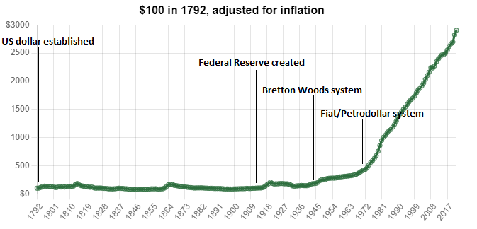

- Note: This article is heavily inspired from Lyn Alden’s book, Broken Money
- At a high level, the world has gone through three stages (and is currently on the horizon of a fourth stage ala digital payments) — commodity money, gold standard, and fiat currency.
- Money can be defined through two lenses: the first defines money as the most salable good in an economy, meaning it is the good which is most capable of being sold, whereas the second lens views money as a series of debts recorded on some ledger.
- The gold standard became the highest form of commodity money, as it is scarce, verifiable, fungible (individual units don’t differ much from each other), portable, and divisible.
    - Paper money emerged as a claim to a certain amount of gold, which eventually led to the fiat currency system, where paper money simply represents itself, and is not backed by a physical commodity.
    - Oftentimes during periods of war, leaders would induce a system of fiat currency, in order to print out more currency rapidly. At the end of this period, leaders would return to a gold standard, but at a lower amount of gold per unit of currency in an effort to devalue the currency)
    - For example, during World War I and II, many countries went off of the gold standard, and returned to this standard after the war. After the war, the United States made gold illegal to own individually through the Bretton Woods act in order to devalue the dollar relative to the amount of gold.
    - After 40 years of the Bretton Woods system, the United States went off of the gold standard in 1971 since they did not have enough gold to maintain redemption for dollars, beginning the period of fiat currency that has lasted until today.
        - The Bretton Woods system was a unique case, since it was technically a pseudo gold standard system, where the dollar was backed by gold, but only redeemable to foreign creditors in limited amounts.
    - However, instead of directly backing currency by gold, the United States made deals with many major oil providers (OPEC and Saudi Arabia) to only sell their dollars, marking the beginning of the **petrodollar** system.
        - Thus, every country that wanted to import oil had to do so through dollars, further emphasizing the United States’ goal of dollar dominance.
        - The petrodollar system gave the United States considerable geopolitical influence, since it had the power to sanction any country and cut it off from the dollar, which was needed to buy oil.
        - In both the Bretton Woods system and the petrodollar system, the United States slowly gave up resources to foreign countries in exchange for their dominance. In the case of the Bretton Woods system, foreigners bought many of the U.S.’s gold reserves, whereas in the petrodollar system, the U.S. gave much of their industrial resources to maintain geopolitical dominance (leading to more than 14 trillion dollars of trade deficits).
        - The petrodollar system created a high demand for dollars, which made U.S. exports more expensive, and hence less valuable, while simultaneously making U.S. imports less expensive. As a result, other companies were able to capture market share in certain exports, like Japan and Germany’s dominance in the auto industry and South Korea and Taiwan’s dominance in the semiconductor industry.
- One of the major results of the fiat currency system is the stark rise in inflation and the subsequent loss in purchasing power of the dollar.

    

    - Easier money creation, lack of intrinsic value, and easier government borrowing have contributed to this decrease in purchasing power.
    - The benefits of fiat money are clear in stable times — they allow governments to spend more than they tax by diluting people’s existing holdings, which are often used to stimulate the economy.
    - However, in times of crisis, fiat money can fail loudly, as they tend to incentivize bigger deficits, and the ability of money to be diluted can allow for longer wars, selective bailouts, and non-transparent forms of government spending.
- The fourth era of money, digital money, will be covered in a different article.