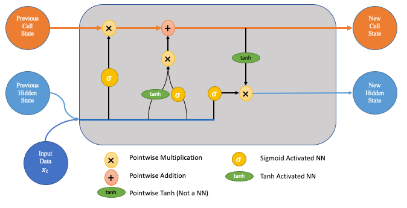

**What is Natural Language Processing (NLP)?**

- NLP is a field of computer science focused on dealing with words and human language, and building models to do operations on our language, from machine translation to text summarization to question answering. NLP has gained significant traction in the past three years with the advent of GPT-3.5 (ChatGPT), and will only get more and more relevant as time goes on and people build better and better models.
- At the core of NLP there exists two fundamental tasks - representation and generation, which allow us to build on to more complex ideas such as understanding or reasoning (specifically - sentiment analysis, question answering). Representation is the task of taking human tokens (such as natural English) and representing each token as a vector in high dimensional space. One desirata for these vectors is that they encode semantic meaning, and we can generate embeddings (vectors) for essentially anything, from words to sentences to entire passages.
- We have three phases of training our models - pretraining, finetuning, and inference. When a model is pre-trained, it means that it has been trained on a vast amount of text data using a technique called self-supervised learning. During pre-training, the model learns to predict missing words in a sentence, mask certain tokens, or predict the next token in a sequence, without needing explicit labels for each task. This process allows the model to develop a rich understanding of the language and its nuances.
- Finetuning adapts the pre-trained model to a specific dataset using supervised learning. Essentially take the pre-trained model and throw it more data in a specific use case to improve its contextualized performance. As one can imagine, one of the largest issues here is quality data curation, as your model is only as good as the data you give it.
- Now, let’s go over the two main model architectures in current NLP (as of Feb 2024) for processing sequential data - Recurrent Neural Networks (RNNs) and Transformers. The fundamental building blocks of these models are called encoders and decoders. An encoder takes some raw input data (say, raw text) and outputs a probability density function, specifying which word is most likely to come next in a sentence. The layer before this output is called the embedding layer which encodes our words into vectors with semantic meaning. A decoder takes those embedding layers as input and returns a sequence of tokens as output.
- A model with an encoder-decoder architecture is called a seq2seq (sequence to sequence) model, which takes in a sequence of tokens and returns a sequence of tokens. RNNs follow this type of architecture, with the most common architecture called a Long Short Term Memory (LSTM) model used for sentiment analysis or machine translation. LSTMs are designed to handle short-term and long-term dependencies in sequential data by maintaining a memory cell that can retain information over multiple time steps. However, they may struggle to capture very long-range dependencies due to issues like vanishing gradients.

- A seminal research paper called “Attention is All You Need” came out in 2017 and revolutionized the field of NLP. This paper introduced the notion of attention, which allows the model to focus on specific parts of the input sequence when making predictions or generating outputs, enabling it to capture long-range dependencies and improve performance on various NLP tasks. Attention operates using a key, value, query mechanism, which allows the model to compute attention scores, essentially telling the model what part of the sequence to pay more attention to.
    - In the traditional encoder-decoder schema of a seq2seq model, our encoder and decoders are both RNNs that keep a hidden state after each time step $t$. At the last time step of the encoder model, we pass the hidden state $h_{t_n}$ as input to the decoder as context for the decoder. $h_{t_n}$ represents our representation of the input sequence. With attention, we pass as input to the decoder $h_{t_1},...,h_{t_n}$, all of the hidden layers from each time step of the encoder. Now, at every time step of the decoder, we assign a score to the hidden states, normalize these scores with softmax, and multiply each vector by its score to give more priority to higher score values. Then we take the sum of the weighted vectors to produce our output.

        

    - Example of how attention works, as we have higher values at each time step of the decoder to reflect paying more attention to different parts of the sentence. More information about attention can be found [here](https://jalammar.github.io/visualizing-neural-machine-translation-mechanics-of-seq2seq-models-with-attention/).
- The notion of attention led to the transformer architecture. Transformers process the entire input sequence in parallel, allowing them to capture long-range dependencies more efficiently. Transformers use self-attention mechanisms to weigh the importance of different tokens in the input sequence, and most importantly do not have a fixed size memory cell like an LSTM. The most popular models nowadays (GPT, LLama, etc.) are some form of a transformer model.

- We can take a look a bit under the hood of how transformers actually work:
    - In the figures above, we have $N=6$ encoders stacked on top of each other (note they do not share weights) and $N$ decoders stacked on top of each other. Each encoder consists of a self-attention (or multi-head attention, just self-attention done $x$ times), layer that feeds to a feed-forward neural network. The decoder is the same thing, except it receives attention values from the encoders, just like how we described attention before.
        - Self-attention works very similarly to attention, except it is a way of looking through at other positions in our input sentence to provide more context for each word. For example, in the sentence “`The animal didn't cross the street because it was too tired`", self-attention allows us to determine what “it” refers to in the context of the sentence.
        - In calculating self-attention, create a query, key, and value matrix for each word. Our score for each word w.r.t word$_i$ is the dot product of the query vector for word$_i$ and the key vector of the word we are scoring. Then softmax all of these values (to normalize between 0 and 1), multiply each value vector by these scores and we get our result.

            

        - This is what everything looks like when we add multi-head self-attention, and normalize after each step. The decoder looks the exact same, except it receives mutli-head attention from the last encoder (called $K$ and $V$).

            

        - Wait a second? How in the world do we go from the output of a decoder, which is a hidden state vector, to a word? We add one final linear layer and a softmax layer, which converts the hidden state vector to a much larger, sparse logits vector representing a one-hot encoding of our dictionary. After a softmax, we get a probability distribution over our dictionary, and we choose the word with the highest probability.
            - Our label distribution might look like:

                

            - Whereas our training output might look like:

                

            - Where at each time step, *we are essentially comparing two probability distributions and minimizing the difference between the two on average throughout our entire dataset.*
    - To put the transformer architecture in our framework of representation and generation, we can think of the stack of encoders as learning hierarchical, expressive representations (as opposed to just having one encoder). By having multiple encoders, we are able to learn different aspects of the input sequence’s representations to better understand complex information. Furthermore, we can think of the stack of decoders as generating a more complex, expressive sequence given our hierarchical, complex understanding of the input sequence from the encoders.
- Now let’s move to the next phase of an NLP pipeline - finetuning. In fine-tuning, the pre-trained model is typically initialized with weights learned from a large corpus or dataset using techniques like self-supervised learning. It is then fine-tuned on a smaller, task-specific dataset using supervised learning techniques.
- One interesting development that has taken off recently is Retrieval Augmented Generation (RAG, introduced in 2017). RAG combines elements of retrieval-based and generation-based approaches to generate text. It involves retrieving relevant information from a knowledge base or corpus and incorporating it into the generated text.

- The above figure gives us a high level overview of how RAG works, courtesy of Jaos [Pambou](https://www.smashingmagazine.com/2024/01/guide-retrieval-augmented-generation-language-models/)
- A newer architecture, called GritLM, was developed by Contextual AI in 2024 to address the limitations of RAG. Namely, traditional ***RAG is computationally far from optimal, because the query and the documents have to be encoded*** ***twice:*** once by the embedding model for retrieval, and once by the language model as context. ([GritLM](https://contextual.ai/training-with-grit/), 2024) This model is a combination of a generative and retrieval based model, and improves the downstream performance and querying time.