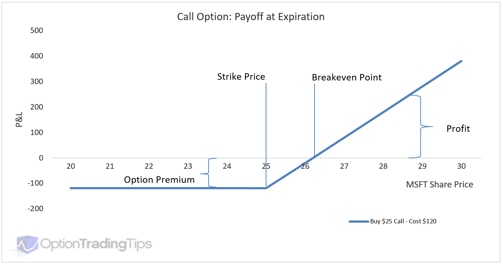

What is an option?

- An option is a type of financial derivative (a financial instrument that *derives* its value from an underlying asset) that gives someone the right, *but not the obligation,* to buy or sell a stock at a certain price, known as the strike price.
    - A European-style option lets us buy or sell at the strike price at a certain date, called the expiration date, whereas an American-style option lets us buy or sell at the strike price at any day up to and including the expiration date.
- An option that gives you the right, *but not the obligation*, to buy a stock at a strike price X is called a call option, and an option that gives you the right, *but not the obligation*, to sell a stock at a strike price Y is called a put option.
- Options are useful because you need less underlying capital to buy or sell a stock as opposed to buying or selling the actual stock itself.

    

- The above graph visualizes this concept for us, by showing up the profits and loss at different values of the stock for a call option. If the underlying stock decreases in value below the strike price, we can lose up to 100% of the price we paid for the option, called the option premium. However, if the underlying stock increases in value above the stock price, we can make a profit.
- Our profit/loss is calculated by $max(S_T-S_t-p, p)$, where $S_T$ is the stock price at the expiration date, $S_t$ is the strike price, and $p$ is the option premium, or the amount we paid for the stock.
- It is important to note that as we get closer to time $T$, the value of the option decreases, as there is less time for the option to move in the desired direction for the holder.

Option Basics:

- The most important concept with respect to options, and broadly in finance, is that of leverage. Leverage in finance means that we are using borrowed capital with the expectation that our return will exceed the amount we borrowed.
    - For example, supposed we have a call option priced at 5 dollars at a strike price of 100 dollars. If the stock’s initial price is `$100` and it moves up to `$110` at the expiration date, we make $10-5=5$ dollars and return 100% of our initial capital. Compare this to just buying the stock itself, as we would only experience a 10% return on our initial investment. Similarly, if the stock moved down to 90 dollars at the expiration date, we lose 5 dollars, which is 100% of our capital. Compare this to if we bought the stock at `100$`, and we would only lose 10% of our initial investment if it went down to `90$`.
    - Leverage does not only apply to options. For example, consider owning a house worth 100$ where we own 20% of the house (`20$`) and the other 80% (`80$`) we borrow to pay the price of the house. If the house appreciates in value to `120$` and we sell the house, we pay back the `80$` we borrowed and made $40-20=\$20$. Conversely, if the house decreased in value to `80$` and we sell the house, we have to pay back the `80$` we borrowed, meaning we lost 100% of our initial equity.
- We can model a portfolio of options using this notion of leverage, where our “replicating portfolio” $\Pi$ is $\alpha$ times the stock price minus $\beta$, where $\alpha$ is the amount of shares we purchase and $\beta$ is the amount we borrow in order to make up this amount. The formula $\Pi = \alpha S -\beta$ is known as the “replicating formula” and allows us to replicate what happens if we purchase a call option.
- Next, we want to determine the price of an option with strike price $k$ as it moves over time. One assumption in order to create this model is to assume that the stock price can move either up by $uS$ or down by $dS$. If the stock moves up, then our new pricing formula is $\alpha uS-\beta = uS-k$, whereas if our stock moves down, then our new pricing formula is $\alpha dS-\beta = max(dS-k,0)$.
- Now, we know that if our stock goes up, our option is worth $uS-k$, and our replicating portfolio is worth $\alpha uS-\beta$. If our stock goes down, our option is worth $max(dS-k, 0)$ and our replicating portfolio is worth $\alpha dS-\beta$. Equating these two sets of equations, we can solve for $\alpha$, $\beta$, and $\Pi$, which tells us that if we wanted to replicate an option with value ($uS-k, max(dS-k,0)$), we buy $\alpha$ shares of the underlying stock $S$ and borrow $\beta$ dollars to pay for the rest, for a call option value $\Pi$.
    - Let’s work through an example to make this clear. Say we have a call option on a stock with strike price 100. If our stock moves up to 110 dollars, the value of our option is $110-100=10$ dollars. The value of our replicating portfolio is $\alpha 110-\beta$. If the stock moves down to 90 dollars, the value of our option is $max(90-100,0)=0$ dollars, and the value of our replicating portfolio is $\alpha 90 -\beta$. Now we have the system of equations $10=\alpha110-\beta, 0=\alpha90-\beta$, and we can solve this sytem to get $\alpha=0.5, \beta=45$, which means that in order to replicate this call option we buy half a share of the stock and borrow 45 dollars to pay the rest. The difference $0.5*100-45=5$ is the fair price of the call option.
    - You might be wondering where the values of $u$ and $d$ come from, and this is a great question. These values come from our perception of the volatility of the underlying stock, which gives us a wider or narrower tree depending on the values of $u$ and $d$.
- Now, as we continue with this binary approach, we can see that a binary tree generates naturally from our initial stock price. After n time steps, we get $2^n$ leafs of our binary tree, which allows us to determine all of the possible prices that could occur at time $t_e$ which is our expiration date. Working backwards from $t_e$, at each of the nodes in the tree we can determine the values of $\alpha$  and $\beta$ to fairly price our option and finally get the fair call option price at $t=t_e$. Note that this model does not include probabilities of the stock moving up or down, and is a discrete time model for determining option prices.

    ```markdown
            _____1_____                  t=t_0 (initial date)
           /           \
        __2__          __3__
       /     \        /     \          ^
      4       5      6       7         |
     / \     / \    / \     / \        |
    8   9   10  11 12  13  14  15      | t=t_e (expiration date)
    ```

    - If we work backwards from the expiration date and calculate the values of $\alpha$ and $\beta$ at each time step, we can calculate the fair option price at $t=t_0$.
    - If we wanted to replicate an option without actually purchasing it, we can dynamically adjust our portfolio at each time step by calculating the necessary $\alpha_{t_i}$ $\beta_{t_i}$ $\Pi_{t_i}$, and adjusting our portfolio as time goes on. This is useful if we are a market maker and want to sell options, since we can replicate buying options to hedge our risk. Or, if we cannot purchase options explicitly for some reason, we can replicate the option by dynamically replicating it.

Continuous Modeling and the Black Scholes Equation

- One of the most powerful parts of the binary discrete time model for option pricing is that it does not include probabilities. Yet, if we add in probabilities we can construct a probability distribution and take the limit as the number of time steps goes to infinity to get the continuous option pricing model.
    - Note that this is one such derivation of the Black Scholes Equation for modeling continuous time option pricing, and the other derivation comes from stochastic differential equations.
- While researching this work, some proposed a fixed probability that a stock moves up given by $q=\frac{u-d}{u+d}$ and $1-q$ that the stock moves down. With this assumption, we know that we can model the price of the stock at time $t=t_e$ with a random variable that follows a binomial distribution.
    - To simplify this, consider a tree of depth 3. At $t=t_e$, we know that one of the nodes can be calculate by ${3 \choose 3}(u^3)[S-k]$ , which is the node where the stock moves up at every time step. Continuing this, we get ${3 \choose 2}(u^2d)[S-k]$  for the next node, ${3 \choose 1}(ud^2)[S-k]$ , and so on. After a certain point, all of these values will just be 0.
- If we take the limit of this binomial distribution as the number of time steps goes to infinity, we get a normal distribution, which we can use to determine the fair price of our options. This is the solution given by the Black-Scholes equation, except part of the normal distribution we cannot sample from, since all of the values will be 0.  ($C(S, t) = N(d_1)S - N(d_2)Ke^{-r(T-t)}$), where

$$
\begin{align*}
d_1 &= \frac{\ln\left(\frac{S}{K}\right) + \left(r + \frac{\sigma^2}{2}\right)(T-t)}{\sigma\sqrt{T-t}} \\
d_2 &= d_1 - \sigma\sqrt{T-t}
\end{align*}
$$

How do we fairly price options [Historical Context and Stochastic Differential Equation Derivation]

- Fairly pricing options is a well-studied mathematical problem that hinges on many different assumptions and has been studied since 1900 with the publication of “Theory of Speculation” by Louis Bachelier.
- Bachelier assumed that at each time step, the price of the stock could either increase +1 or decrease -1 with equal probability $p=1/2$. This is known as a random walk, a type of stochastic process that laid the modern foundation for option pricing models today like Black-Scholes.
- Bachelier then assumed that price changes of a stock over time are normally distributed, centered at the initial price we buy the option at.

    

- With this assumption of normally distributed stock prices, Bachelier took the P&L graph from earlier and multiplied it by this normal distribution to obtain the expected value of an option.

    

- Bachelier argued that the fair price for an option is what makes this expected value (i.e. the expected return for the investor) equal to 0. So, the buyer and seller have an equal likelihood of making money.

Modern Option Pricing:

- Black, Scholes, and Merton introduced an equation in 1973 that allowed anyone to calculate the fair price of a European option, and won the Nobel Prize in Economics for it.
- Like Bachelier, they argued that the fair price of an option comes from a buyer and seller having an equally likelihood of making money, which they formalize via a risk free portfolio of options, $\Pi = V - \Delta S$.
    - The term $V - \Delta S$ represents the value of the portfolio constructed by buying one unit of the option ($V$) and shorting $Δ$ units of the underlying asset ($S$).  By doing so, the portfolio replicates the payoffs of holding the option position alone. $\Delta$ represents the sensitivity of the option’s price to movement in the underlying stock.
- Under the assumption of the Efficient Markets Hypothesis (which states that asset prices reflect all fully available information, so it is impossible to make outperform the market), the portfolio should return $r\Pi$, where $r$ is the risk-free rate.
    - The Risk Free Rate is the current short-term treasury rate, which is considered “risk-free” because the U.S. government
- The key insight of the Black-Scholes model is the assumption that stock prices follow a *geometric Brownian motion*, which is a special type of random walk that cannot go negative (since stock prices cannot go negative).
    - They model the change in the stock price by the formula $dS = \mu S dt + \sigma Sdz$, where $\mu$ represents the rate of drift of the stock and $\sigma$ represents the random volatility.
    - We can model the return of the portfolio as $d\Pi = dV - \frac{\partial V(s,t)}{\partial S} S$ combined with the return on a risk free portfolio as $d\Pi = r \Pi dt$, which simplifies to the famous equation:
    - $\frac{\partial V}{\partial t} + rS \frac{\partial V}{\partial S} + \frac{1}{2} \sigma^2S^2\frac{\partial^2 V}{\partial S^2}-rV = 0$, which is a second order partial differential equation used to model the “fair” price of an option. Note $V=V(s,t)$, where $s$ is the  stock price at time $t$.